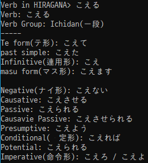

# jpVerbConjugate
Conjugates Japanese verbs, for example as following:

Please bear in mind that Kanjis may not be displayed properly depending on system configurations. Please make sure that your terminal supports Unicode text.
